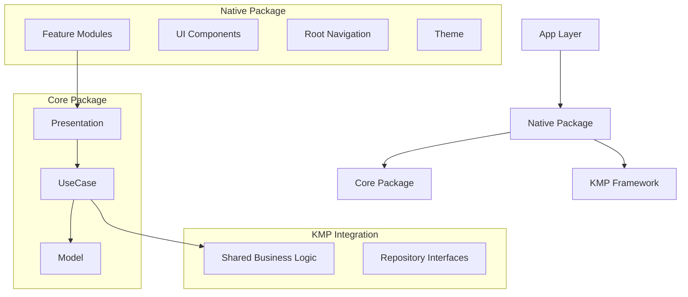
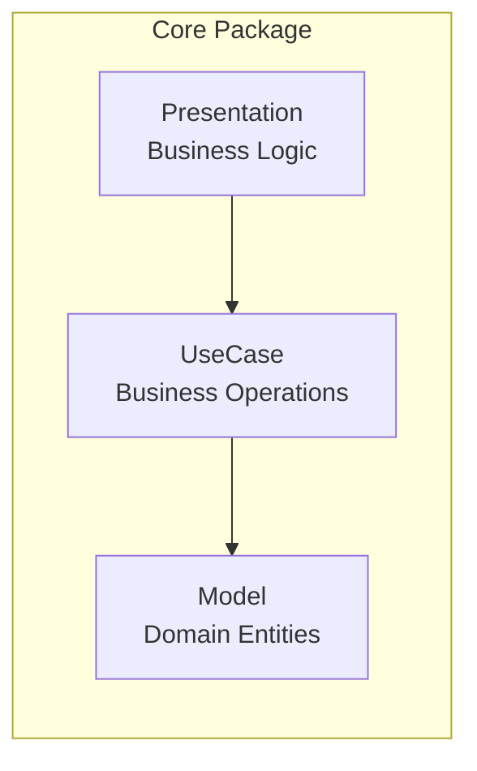
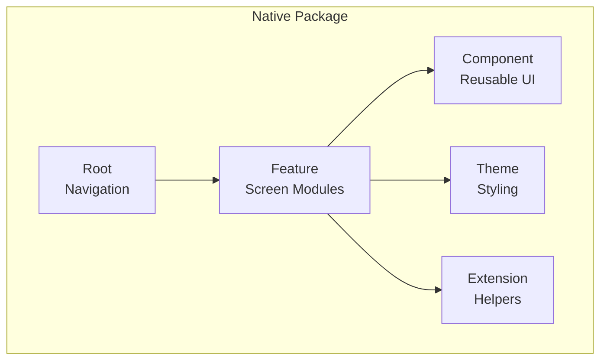
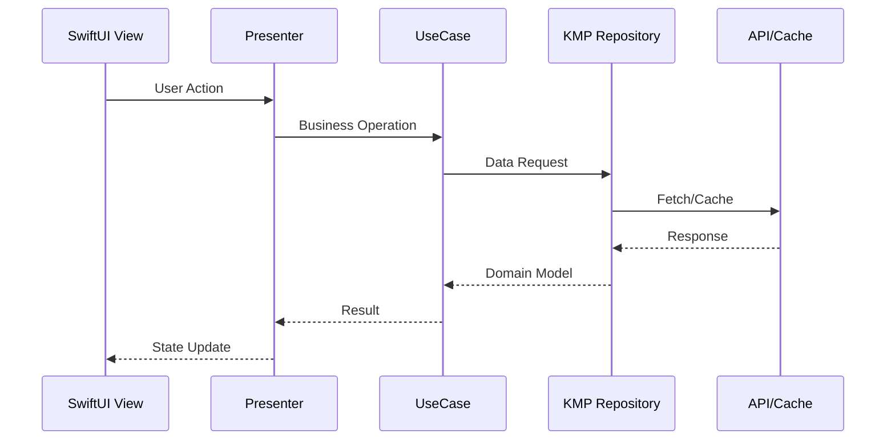
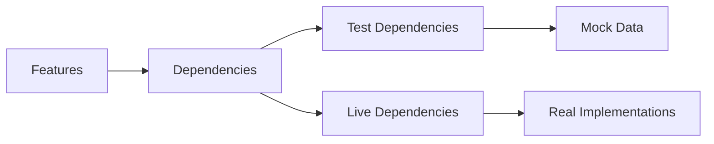
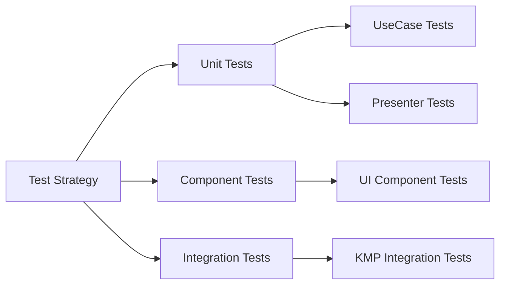
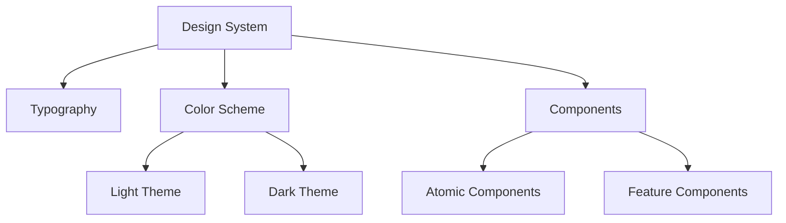
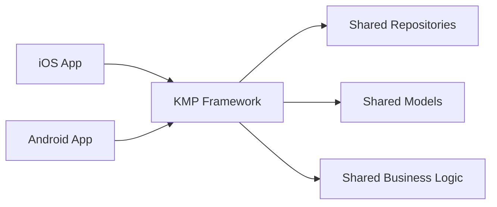

# DroidKaigi 2025 iOS App

iOS application for the DroidKaigi 2025 conference, built with Swift 6 and SwiftUI.

## 📱 Overview

The DroidKaigi 2025 iOS app is part of a multi-platform project that provides conference attendees with schedule management, speaker information, and venue navigation. The app is built using modern iOS development practices with a focus on clean architecture and code quality.

### Key Features
- 📅 Conference timetable with list and grid views
- ⭐ Favorites management for sessions
- 👥 Speaker profiles and information
- 🗺️ Venue maps and room navigation
- 🏠 Conference overview and announcements
- 🏢 Sponsor showcase

## 🏗️ Architecture

### Overview

The iOS app follows a clean, modular architecture with clear separation of concerns:



### Package Structure

#### Core Package (`Core/`)
Platform-independent business logic and domain models:



- **Model**: Data models and domain entities (e.g., `Timetable`, `Speaker`, `Room`)
- **Presentation**: Presenters handling business logic for features
- **UseCase**: Specific business operations (e.g., `TimetableUseCase`, `SponsorUseCase`)

#### Native Package (`Native/`)
iOS-specific implementation and UI:



- **Component**: Reusable UI components (`TimetableCard`, `TimeGroupList`, etc.)
- **Feature**: Feature modules (Home, Timetable, Favorite, etc.)
- **Root**: App initialization and navigation management
- **Theme**: Design system and styling
- **Extension**: Helper extensions for views and models

### Data Flow



### Dependency Injection

The app uses Point-Free's `swift-dependencies` library for dependency management:



## 🚀 Getting Started

### Prerequisites

- **Xcode**: 16.0 or later
- **Swift**: 6.1.2
- **macOS**: 15.0 or later
- **iOS Deployment Target**: 18.0

### Setup

1. Clone the repository:
```bash
git clone https://github.com/DroidKaigi/conference-app-2025.git
cd conference-app-2025/app-ios
```

2. Setup the project:
```bash
make setup
```
Note: This installs SwiftLint via Swift Package Plugin. The `nestfile.yml` configuration is no longer needed.

3. Open the project:
```bash
open DroidKaigi2025.xcodeproj
```

4. Build and run:
   - Select the `DroidKaigi2025` scheme
   - Choose your target device/simulator
   - Press `Cmd+R` to build and run

### Build Commands

For detailed build commands and development instructions, see [CLAUDE.md](./CLAUDE.md#build-and-development-commands).

## 🧪 Testing

The project uses Apple's new Swift Testing framework (not XCTest):



### Running Tests

```bash
# Run all tests
make test

# Run specific test targets
xcodebuild test -project DroidKaigi2025.xcodeproj -scheme ComponentTests -destination 'platform=iOS Simulator,name=iPhone 15 Pro'
xcodebuild test -project DroidKaigi2025.xcodeproj -scheme UseCaseTests -destination 'platform=iOS Simulator,name=iPhone 15 Pro'
```

For more testing commands, see [CLAUDE.md](./CLAUDE.md#running-tests).

## 🛠️ Development

### Code Quality Tools

#### SwiftLint
- Runs automatically during build via Swift Package Plugin
- Configuration: `.swiftlint.yml`
- Manual check: `make lint`
- Auto-fix: `make lint-fix`
- Xcode integration: `scripts/xcode-lint.sh` for incremental linting of modified files only

#### swift-format
- Configuration: `.swift-format`
- Format code: `make format`
- Check format: `make format-check`

#### Xcode Build Phase Scripts
For faster incremental builds, the project includes:
```bash
scripts/xcode-lint.sh  # Lints only modified files during builds
```
See [scripts/README.md](./scripts/README.md) for setup instructions.

### Makefile Commands

```bash
make help          # Show all available commands
make setup         # Initial project setup (installs dependencies)
make build         # Build all packages with prebuilt SwiftSyntax
make test          # Run Core tests (Linux-compatible)
make test-native   # Run Native module tests (macOS only)
make test-all      # Run all tests (Core + Native, macOS only)
make lint          # Run SwiftLint
make lint-fix      # Auto-fix linting issues
make format        # Format code with swift-format
make format-check  # Check code formatting (fails on warnings)
make pre-commit    # Run all checks before committing
make clean         # Clean build artifacts
make reset         # Reset project (clean + resolve dependencies)
make xcode         # Open project in Xcode
make xcode-build   # Build with Xcode
make xcode-test    # Run tests with Xcode
make ci            # Run CI checks (lint + Core tests)
```

### Available Schemes

- `DroidKaigi2025` - Main app
- `ComponentTests` - UI component tests
- `Model` - Data model library
- `Presentation` - Presentation layer
- `Root` - Root navigation
- `UseCaseTests` - Business logic tests

## 🎨 Design System

The app implements a comprehensive design system:



### Typography
Custom typography system defined in `Theme/Typography.swift`

### Color System
Material Design 3 inspired color palette with semantic naming:
- Primary, Secondary, Tertiary colors
- Surface and background colors
- Error states
- Special colors for animals (Giraffe, Jellyfish, etc.)

## 🔗 KMP Integration

The iOS app integrates with Kotlin Multiplatform for shared business logic:



### Current Integration Points
- Timetable data management
- Room and speaker information
- Favorites synchronization
- Conference metadata

### Implementation Notes
- **Sponsor Data**: Currently using mock data in `SponsorUseCaseImpl` as KMP doesn't have sponsorsRepository yet. When available, it will follow the same pattern as `TimetableUseCaseImpl`.
- **SwiftLint**: Now runs via Swift Package Plugin, removing the need for separate installation
- **Build Performance**: Use `scripts/xcode-lint.sh` for incremental linting during development

## 📦 Project Structure

```
app-ios/
├── App/                    # Main app target
│   ├── Assets.xcassets/   # App icons and assets
│   └── DroidKaigi2025App.swift
├── Core/                   # Business logic package
│   ├── Sources/
│   │   ├── Model/         # Domain entities
│   │   ├── Presentation/  # Presenters
│   │   └── UseCase/       # Business operations
│   └── Tests/
├── Native/                 # iOS-specific package
│   ├── Sources/
│   │   ├── Component/     # Reusable UI
│   │   ├── Feature/       # Feature modules
│   │   ├── Root/          # Navigation & KMP
│   │   └── Theme/         # Design system
│   └── Tests/
├── DroidKaigi2025.xcodeproj/
├── Makefile               # Build automation
├── README.md              # This file
└── CLAUDE.md             # AI assistant guide
```

## 🐛 Known Issues & Debugging

### Build Issues
- **Swift Dependencies Macro Error**: Known issue with swift-dependencies package
  - Use `-skipMacroValidation` flag when building
  - App may still work on simulator despite errors

### Debugging Tips
For UI testing and debugging, consider using Mobile MCP tools:
- `mobile_launch_app`
- `mobile_take_screenshot`
- `mobile_list_elements_on_screen`

For more debugging information, see [CLAUDE.md](./CLAUDE.md#important-build-and-debug-notes).

## 🤝 Contributing

1. Follow the existing code style and architecture patterns
2. Ensure all tests pass before submitting
3. Run code quality checks: `make pre-commit`
4. Update documentation as needed

## 📄 License

This project is part of the DroidKaigi 2025 conference app. See the repository root for license information.

## 🔗 Related Documentation

- [CLAUDE.md](./CLAUDE.md) - Detailed technical guide for AI assistants
- [Main Repository README](../README.md) - Overall project documentation
- [Android App Documentation](../app-android/README.md) - Android implementation details